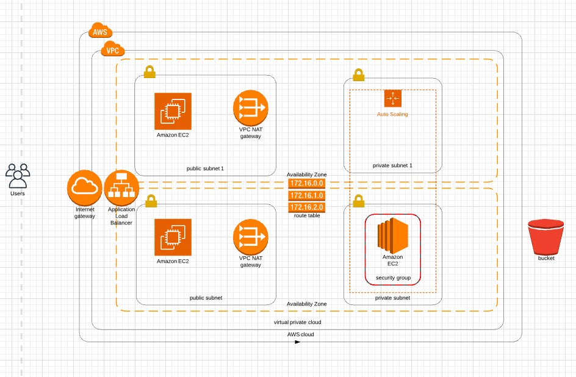

# Code-To-Infrastructure-AWS-Cloudformation



This cloud formation template deploys a EC2 instance with a VPC.

### How to Run?

#### PreRequisites

- AWS CLI

#### Setup Project:

##### 1. Set Up network:

```
$ aws cloudformation create-stack --stack-name <STACK NAME>  --region us-east-1 --template-body file://network.yml --parameters file://network_params.json
```

##### 2. Set Up SERVER:

```
$ aws cloudformation create-stack --stack-name <STACK NAME>  --region us-east-1 --template-body file://just_ec2.yml --parameters file://server_params.json
```

##### 3. Check EC2, VPC and CloudFormation consoles.

Note : In `server_params.json` file `EnvironmentName` must be used whose VPC is already created.

####References
https://medium.com/faun/aws-cloudformation-essentials-notes-from-the-field-8ed7162e0c5

For Egress and Ingress Rules : https://github.com/hashicorp/terraform/issues/14382
